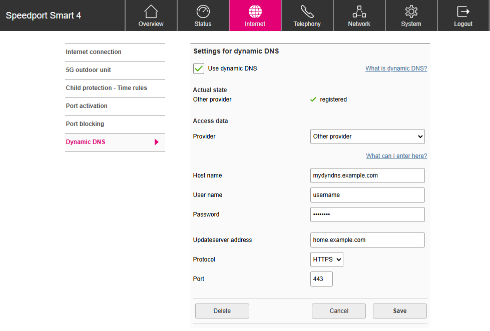

# cloudflare-dyndns-speedport

Middleware for updating [Cloudflare](https://www.cloudflare.com/) DNS records through a Telekom Speedport Smart 4 Router.

## Getting started

### Create a Cloudflare API token

Create a [Cloudflare API token](https://dash.cloudflare.com/profile/api-tokens) with **read permissions** for the scope `Zone.Zone` and **edit permissions** for the scope `Zone.DNS`.


### Run on Docker

```bash
docker run -p 80:80 ghcr.io/germandarknes/cloudflare-dyndns-speedport:main
```

### Example docker-compose

```
services:
  dyndns-server:
    image: ghcr.io/germandarknes/cloudflare-dyndns-speedport:main
    environment:
      - CLOUDFLARE_TOKEN=EXAMPLETOKEN
      - CLOUDFLARE_ZONE=example.com
    restart: unless-stopped
    ports:
      - "127.0.0.1:4050:80"
```

### Example nginx reverse proxy with basic auth

```
server {
    listen 80;
    server_name mydyndns.example.com;

    auth_basic "Restricted";
    auth_basic_user_file /var/www/.htpasswd;

    location / {
        proxy_pass_header Server;
        proxy_set_header Host $host;
        proxy_set_header X-Real-IP $remote_addr;
        proxy_set_header X-Forwarded-For $proxy_add_x_forwarded_for;
        proxy_set_header X-Forwarded-Proto $scheme;

        proxy_connect_timeout 1d;
        proxy_send_timeout 1d;
        proxy_read_timeout 1d;
        send_timeout 1d;

        proxy_pass http://127.0.0.1:4050/;
    }
}
```

### Configure your Telekom Speedport Smart 4

